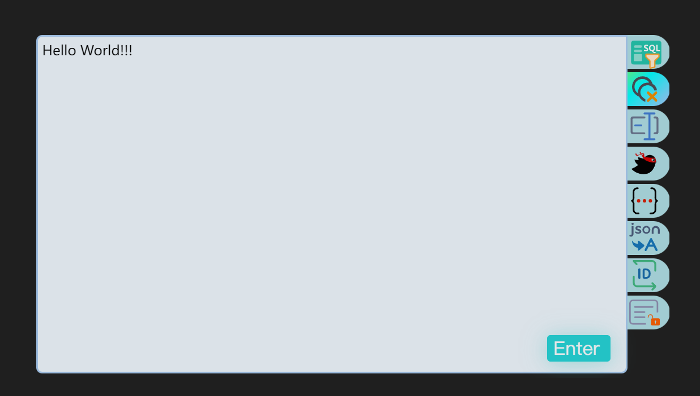
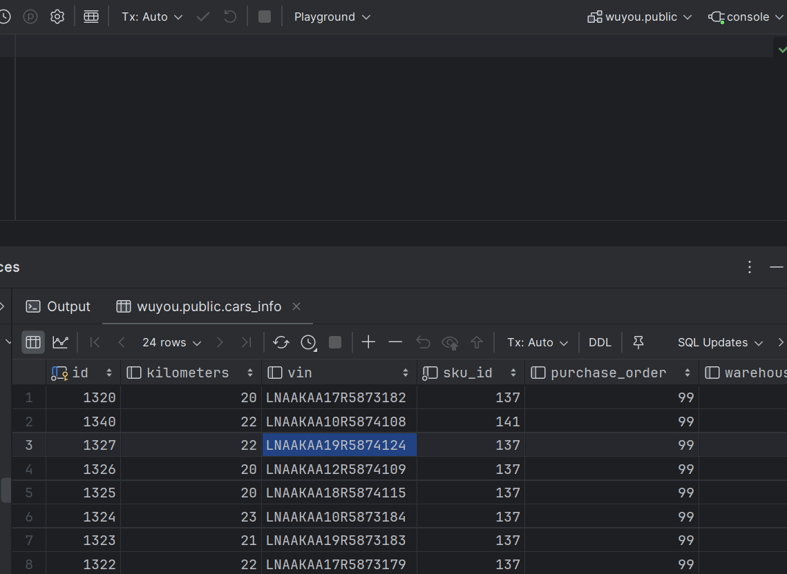

# 字符串工具V2版本
> 与上个版本相比 ,主要是优化了代码结构和界面显示效果,增加了一些新功能,以及更新了electron版本,当然也有一些新bug.
## 软件介绍

工作中经常需要对各种字符串进行处理 , 不胜其烦 , 因此开发了这款软件. 

打开之后运行在后台以及显示在托盘中，使用快捷键`ctrl+shift+2`即可唤起此工具。它能够自动读取剪贴板上的文本内容，并通过AI智能分析，挑选出最适合的处理方式。您只需按下Enter键或点击Enter按钮，便能轻松完成字符串的处理，同时处理结果会自动写到剪贴板。若需更换处理方式，点击界面右侧相应的图标即可切换。
在托盘处对图标右键即可退出程序.
右侧icon区域从上到下功能分别代表
* 从SQL中提取数据
* 数据排序并去重
* 命名规则转换
* 从mybatis日志中提取sql 以及从mybatis注解中获取sql
* json预览
* 从json中提取数据
* id 拼接方式的转换
* saa系统用户密码解密以及saa请求与返回信息的解密

## 功能详细介绍
### SQL提取数据

有时想从DataGrip中复制某一列的数据,粘贴的时候才发现源格式是sql, 在该回去就比较麻烦了,唤起工具一键转换
### 数据排序并去重
可以把一批数据进行排序并去重.js对long类型处理不准确,此处理方法中使用了`bignumber.js`
### 命名规则转换
把变量名在驼峰 下划线以及帕斯卡三种命名规则之间转换,多行时支持批量处理,
### MyBatis
两个功能,一个是从JAVA注解上提取引号内的SQL.另一个是从日志中提取mybatis日志 .此外,容器POD的实时日志会自动加入`\n`进行换行,因此需要先删除多余的`\n`在进行转换.
### json预览
我在工具中内嵌了一个http服务器,部署了一个json可视化工具 [jsoncrack](https://github.com/AykutSarac/jsoncrack.com) , 并改造了源码实现加载本地缓存中的json字符串.

因此当识别到json的时候, 可以打开这个json可视化工具. 

除了'jsoncrack' 另外一款非常优秀的json可视化工具是[jsonhero](https://jsonhero.io/), 这个工具是前后端一起部署的,所以更麻烦一些.还在改造中
### json中提取数据

类似于SQL中提取数据,DataGrip也会复制json格式,从json数组中提取数据.

### ID拼接

以不同的方式拼接ID,一图胜千言
### 解密
可以把saa主系统中的用户密码,http内容体信息进行解密.密钥key保存在系统的环境变量中

## 依赖组件

bignumber.js : 排序的时候用于保存数字精度
crypto : 解密中用到
crypto-js : 解密中用到
electron-squirrel-startup : 打包electron 功能
express : nodejs的服务器,部署 jsoncrack
json-bigint : 序列化json的时候保存数字精度
lru-cache : lru缓存控制器, 自动淘汰过期的数据
node-forge : electron 相关
safe-eval : 解析mybatis注解上的sql

## 已知bug
* 有时候用快捷键打开的时候会闪一下, 怀疑是electron本身的bug -- 果然是windows 和electron 交互的一个bug,问题和解决方案见:https://github.com/electron/electron/issues/12130
* 有时候处理字符串会失败.但是重新打开又可以处理,还没想到是什么原因.

## todo
* 增加`jsonhero`工具
* 增加设置和介绍页面
* 增加导入功能,能像chrome那样支持用户安装或者卸载插件

## 如何定制自己的功能
代码非常非常简单,准备一个自己的喜欢的icon放到fun-icon目录下,仿照texthandler文件夹下的任意一个js写个处理器.然后加入到`preload.mjs`中的`solvers`数组即可