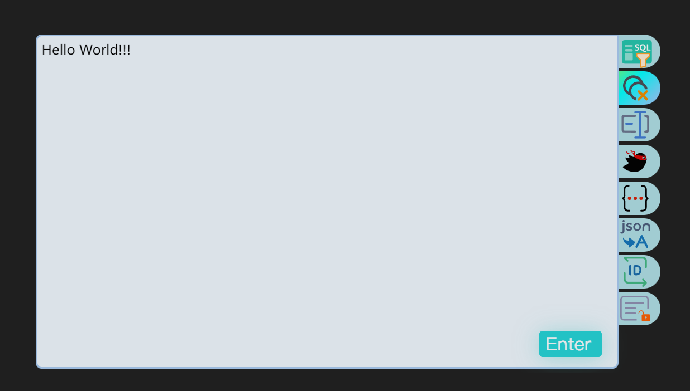
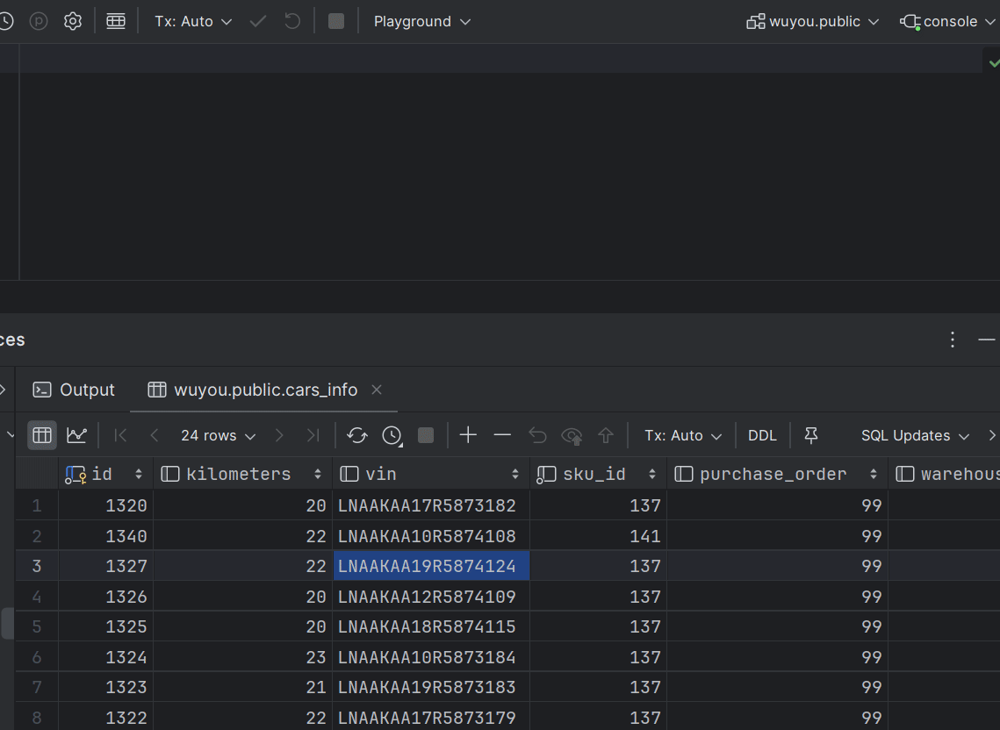
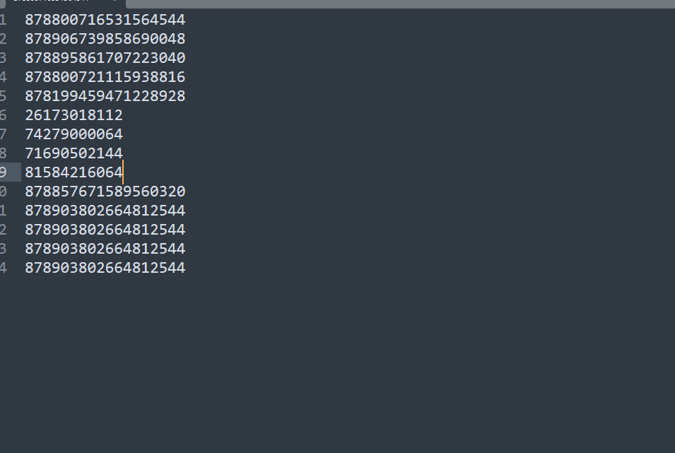
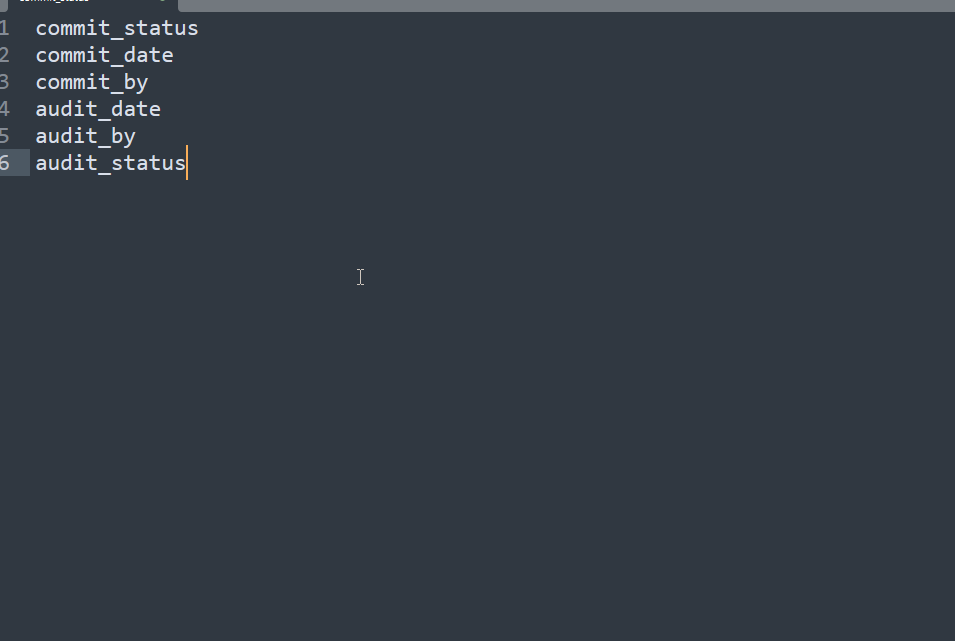
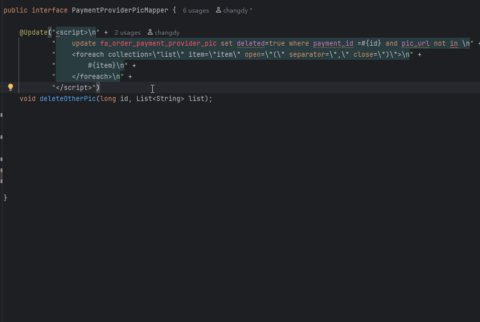
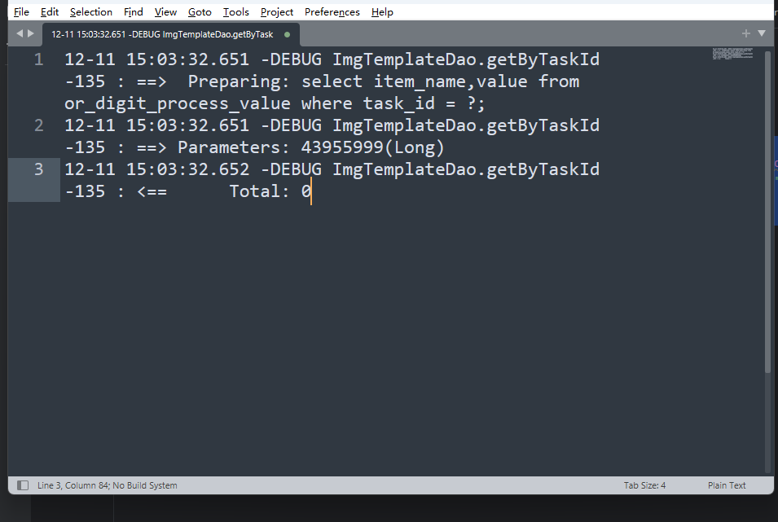
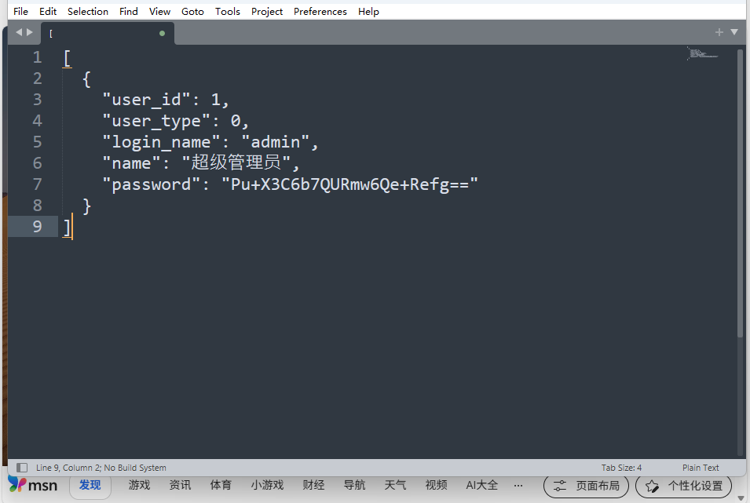
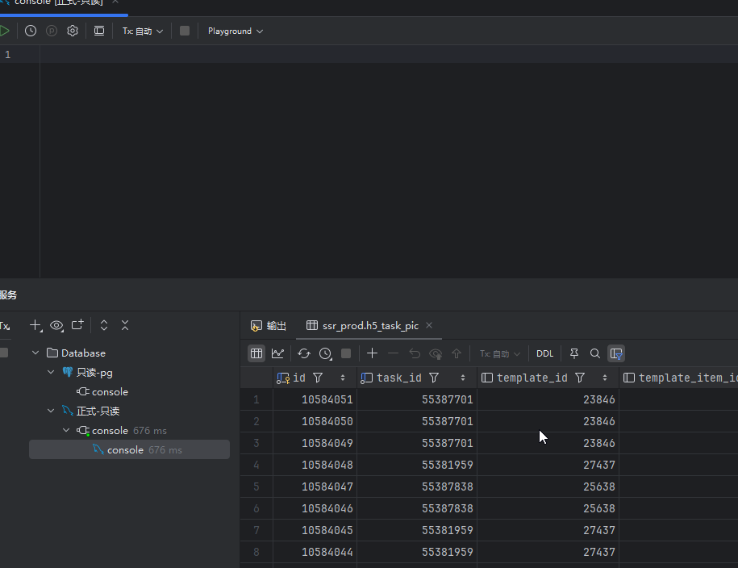
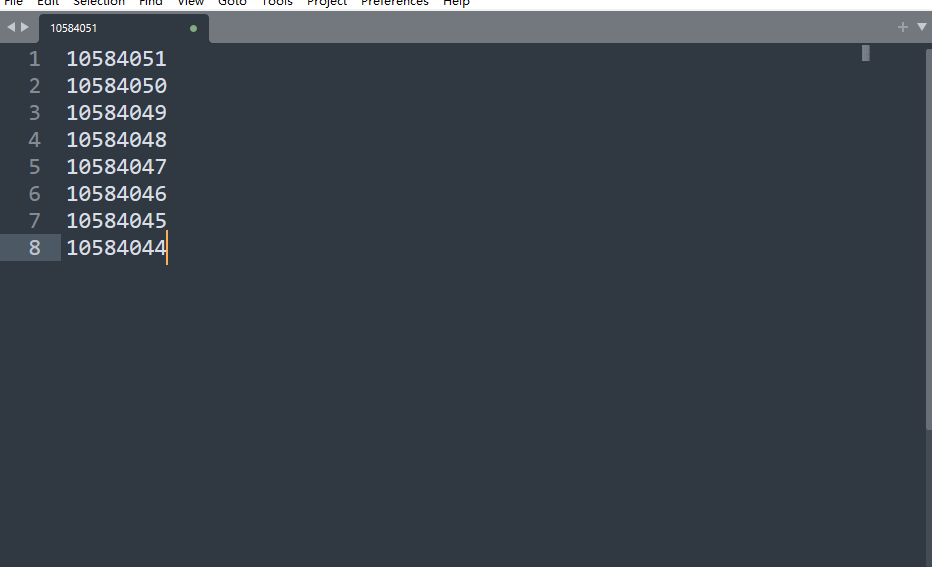

# 字符串工具V2版本
> 与上个版本相比 ,主要是优化了代码结构和界面显示效果,增加了一些新功能,以及更新了electron版本,当然也有一些新bug.
## 软件介绍

工作中需要对字符串进行各种处理 , 不胜其烦 , 因此开发了这款软件. 

打开之后软件会运行在无窗口模式, 使用快捷键`ctrl+alt+d`即可唤醒 . 唤醒时会自动读取粘贴板文本 , 并通过AI智能分析 ,挑选出最适合的处理方式.
按下回车或点击`Enter`按钮,便能完成字符串的处理 ,结果也会自动写会粘贴板.
也可点击侧边对应的icon, 选择对应的

## 功能介绍
### SQL提取数据
可以从datagrip的导出sql中提取数据

### 数据排序并去重
简单用的话还不错,复杂的话最好是excel的高亮重复项

### 命名规则转换

### MyBatis
功能1: 从Mybatis 注解中提取sql

功能2: 从Mybatis Log中提取sql

### json预览
工具内部嵌套了一个http服务器,端口9987. 部署了 [jsoncrack](https://github.com/AykutSarac/jsoncrack.com)
除了`jsoncrack` 还有另一款非常优秀的json可视化工具[jsonhero](https://jsonhero.io/) ,但由于是前后但一起部署的,还没想好怎么部署.

### json中提取数据
可以从datagrip的导出json中提取数据

### ID拼接
用几种不同的方式拼接字符串

## 依赖组件

bignumber.js : 排序的时候用于保存数字精度

crypto : 解密中用到

crypto-js : 解密中用到

electron-squirrel-startup : 打包electron 功能

express : nodejs的服务器,部署 jsoncrack

json-bigint : 序列化json的时候保存数字精度

lru-cache : 搭配 json-crack使用

node-forge : electron 相关

safe-eval : 解析mybatis注解上的sql

## 增加自定义脚本

## 已知bug
* 

## todo
* 增加json对比功能,计划使用 vscode的diff

## 如何定制自己的功能
代码非常非常简单,准备一个自己的喜欢的icon放到fun-icon目录下,仿照texthandler文件夹下的任意一个js写个处理器.然后加入到`preload.mjs`中的`solvers`数组即可