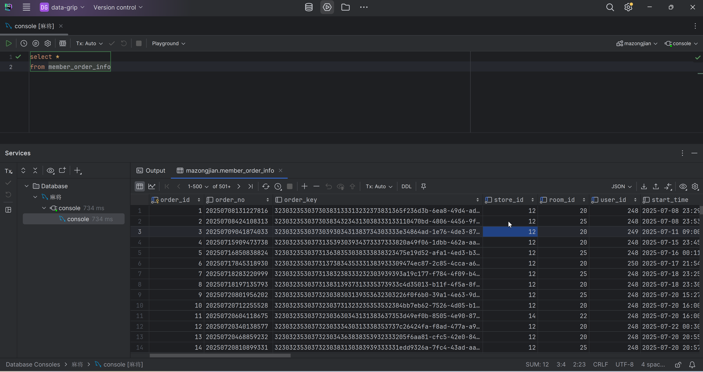

# 字符串工具 V2


## 软件介绍


工作中频繁需要对字符串进行各种处理，不胜其烦，因此开发了这款工具。部分功能是为了解决在datagrip中批量获取sql语句时，需要手动复制粘贴的问题。

启动后软件以无窗口模式运行于系统托盘，使用快捷键 `Ctrl+Alt+D` 即可唤醒。唤醒时自动读取剪贴板文本，并通过 AI 智能分析，挑选出最适合的处理方式。按下回车或点击 `Enter` 按钮即可完成处理，结果自动写回剪贴板。也可点击侧边对应的 icon，手动选择需要的处理方式。


软件内嵌了两个 JSON 可视化工具，启动时自动在本地启动 HTTP 服务，无需联网即可使用：

- [jsoncrack](https://github.com/AykutSarac/jsoncrack.com)：将 JSON 以节点关系图的形式展示，直观呈现数据结构层级（本地端口 9987 起自动分配）
- [jsonhero](https://jsonhero.io/)：以树形视图展示 JSON，支持路径导航、类型高亮和搜索，适合快速定位深层字段（本地端口 13001 起自动分配, 这个东西我进行了一些魔改.因为原版是remix全栈+边缘计算.我后面改成了普通的前后端分离项目,相关代码可以在打包流程里面找到）

## 功能一览

| 说明 | 预览 |
|------|------|
| 可以批量从update语句中提取数据 |  |
| 对文本排序并去除重复项 |  |
| camelCase / snake_case / PascalCase 等互转 |  |
| 从 MyBatis 注解中提取可执行 SQL |  |
| 从 MyBatis 日志中提取可执行 SQL |  |
|  同时打开json-hero和json-crack预览json |  |
| 批量从update语句中提取数据(主要针对datagrip) |  |
| 以多种分隔符拼接字符串 |  |
| 使用 VSCode Diff 对比两段 JSON |                                              |


## 下载安装

前往 [Releases](../../releases) 页面下载对应平台安装包：

- **Windows**: `setup.exe`
- **macOS (Intel)**: `*-x64.dmg`
- **macOS (Apple Silicon)**: `*-arm64.dmg`
- **Linux**: `*.AppImage`

## 开发

```bash
# 安装依赖
npm install

# 构建 jsoncrack / jsonhero 资源
npm run build:jsoncrack
npm run fetch:jsonhero

# 启动开发
npm start

# 打包（不发布）
npm run build
```

## 自定义脚本

在用户数据目录下的 `user-scripts` 文件夹中放入 `.js` 文件，软件启动时会自动加载。

### 图标

每个脚本需要配套一个同名的 `.svg` 图标文件，放在同一目录下。例如脚本名为 `my-tool.js`，则图标为 `my-tool.svg`。图标会显示在侧边工具栏中。

### 脚本结构

每个脚本必须导出一个 `solver` 对象，包含以下字段：

```js
const solver = {
  name: "my-tool",          // 唯一标识，同时用于匹配图标（my-tool.svg）
  describe: "我的工具",    // 描述文本，显示为图标的 alt 提示
  nextStep: "id-join",    // 可选，处理完成后自动切换到指定处理器
  style: "body { ... }",  // 可选，注入自定义 CSS
};

// check(logs, arr, jsonFlag) → number
// 返回匹配权重（0 表示不匹配，值越大优先级越高）
// - logs: 剪贴板原始文本
// - arr: 按换行符分割后的数组
// - jsonFlag: 文本是否为 JSON 格式
solver.check = (logs, arr, jsonFlag) => {
  return arr.length > 0 && !jsonFlag ? 100 : 0;
};

// transfer(logs, arr, jsonFlag) → string
// 执行实际处理，返回结果文本（会自动写入剪贴板）
// 参数同 check
solver.transfer = (logs, arr, jsonFlag) => {
  return arr.join(",");
};

export { solver };
```

脚本中可以使用 `require` 加载应用内置依赖（如 `crypto-js`、`node-forge` 等），也可使用全局变量 `CryptoJS`、`nodeCrypto`、`forge`。


## 依赖说明

| 依赖 | 用途 |
|------|------|
| [bignumber.js](https://github.com/MikeMcl/bignumber.js) | 排序时保持数字精度 |
| [crypto-js](https://github.com/brix/crypto-js) | 解密功能 |
| [express](https://github.com/expressjs/express) | 内嵌 HTTP 服务器，部署 jsoncrack |
| [json-bigint](https://github.com/sidorares/json-bigint) | 序列化 JSON 时保持大数字精度 |
| [lru-cache](https://github.com/isaacs/node-lru-cache) | 搭配 jsoncrack 使用 |
| [node-forge](https://github.com/digitalbazaar/forge) | Electron 相关加密功能 |
| [electron-log](https://github.com/megahertz/electron-log) | 日志记录 |
| [electron-store](https://github.com/sindresorhus/electron-store) | 持久化配置存储 |
| [axios](https://github.com/axios/axios) | HTTP 请求 |
